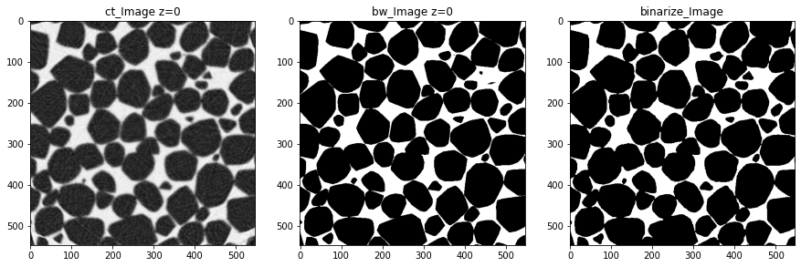
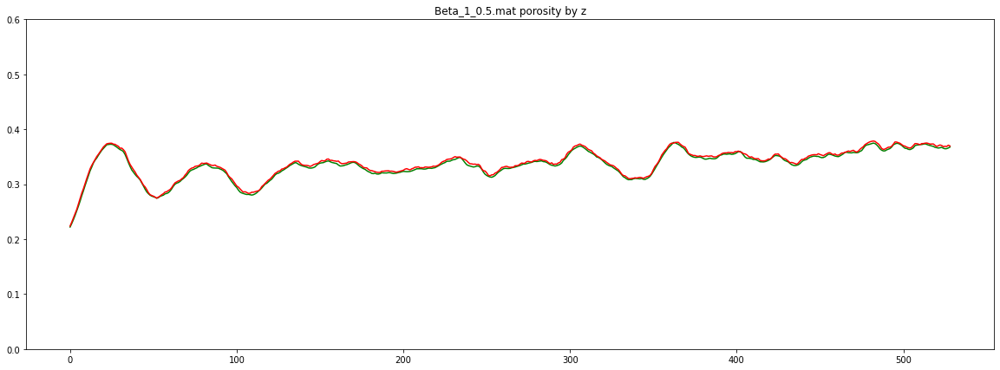

# Aramco_Upstream_Solutions_Technathon_2020
7 November - 13 December 2020

### Team:
1. Vladimir Khomyakov (team leader)
2. Nikita Parfenov
3. Amir Ayupov
4. Anton Khanaev

### Problem formulation
The use of digital rock models provides relatively inexpensive, non-destructive methodology for studying rocks. Digital rocks models are being used in the oil and gas industry to numerically simulate several properties such as absolute permeability, relative permeability, electrical and elastic properties. These simulations can be done in 2D and 3D. Unfortunately, to date, there is not deterministic relationship to convert 2D results to 3D. Thus, numerical simulation performed on 3D digital models is preferred.

To obtain 3D digital rock models, computational tomography is typically performed on a rock sample. The procedure is relatively slow. Other types of rock images, such as thin section images, are more readily available. These images are 2D images. The question is: can these 2D images be utilized to construct realistic 3D models to be used for accurate numerical simulation?

### Required solution
The solution would be a software that takes a 2D image or a relatively small number of 2D images and produces a realistic 3D model for rocks.

### Details of challenge
The participants will be provided with a number of 2D images and their corresponding 3D models. 

### Available data
Synthetic images of rocks which can be obtained using simulators such as obtained from discrete element method.

### Evaluation of solution performance
The performance is evaluated based on the difference in simulation results in the “true” and constructed models. Free software is used to compare the two models. In the last week, 2D images are given and participants are asked to construct the 3D model and provide simulation results for their models.

# Solution

## Stage 1 - completed
## Slice image segmentation and segmented binarization
Trained neural network Unet with efficientnet b0 backbone
Pipeline training:
1. Splitting list matfiles into a training part and a validation part into a ratio of 75% of files to a training part
2. From each training matfile, 50 random slices are taken along the x, y, z axis
3. Augmentation: random rotation by 15 degrees, random image enlargement up to 5%, random crop size 512x512 px. Used lib albumentation
Result: evalf_predict_porosity.ipynb
Shows examples of segmentation of original images and calculated porosity on each layer along the z-axis for groundtruth marking and predicted marking

## Stage 2 - 60&
## 3d reconstruction based on one or relatively small number of 2d slices
1. Slice prediction 10 steps ahead based on one slice
